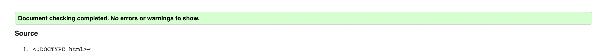

# Muhammad Ali Tribute Website

The Muhammad Ali Tribute website is a website directed towards boxing and sporting fans who are looking for some interesting facts about the boxing legend Muhammad Ali.
The website offers a sign up form to a news letter where if they sign up they get weekly emails highlighting legends of the boxing world.

# Features

 ## The Navigation Section 

- At the top left of the page there is a logo: MUHAMMAD ALI, when this logo is clicked it links to the top of the page.
- At the top right of the page thre is another three navigation links: HOME will bring the user to the hero section of the page, ACHIEVEMENTS will bring the user to the achievements section and SIGN UP will bring the user to the sign up form.
- The navigation is a contrasting color compared to the background and has a simple, clean modern font.
- The navigation lets the user navigate faster if they do not want to scroll and it clearly shows what sections the page has. 
- There is a nice hover effect on the navigstion so the users knows what they are cliking.

## The Header Section

- The header section is an attractive section that grabs the users attention.
- The header shows a statement about Muhammad Ali. Under this statement there is a button that the user can click if they are interested in learning more.
- This section clearly shows what the page is about.

## The Achievements Section

- The Achievements section provides some major facts about Muhammad Ali, it talks about how he is an Olympic gold medalist, how he has been a heavyweight champion multiple times and most of all how he was not just a boxer, he helped people also.
- This section teaches the user a little bit about Muhammad Ali if they did not know who he was, or if they do know who he was it teaches them some facts they may not have known.
- The section is structured in a simple not so information heavy way as to not mentally exhaust and bombared them with lines of plain typing. It is very clean and easy to read.

## The Sign Up Section

- The Sign Up section gives the user the option to sign up for a news letter.
- The news letter provides the user with weekly emails that contains facts about legendary boxers so that they are never forgotten.
- The form is sleek and simple and does not require the user a lot of time to complete, it is straight to the point.

## The Footer Section

- The footer section has a clean design and its purpose is clear.
- This section allows the user to find the other social media pages of this website if they have enjoyed the page.

# Validators

## The code has been passed through validators to make sure there are no errors

- It was passed through the w3c html validator.

- It was passed through the Jigsaw css validator.

- And lastly we ran the lighthouse test.

# Testing

- I tested that this page works in different browsers such as: Mozilla Firefox, Google Chrome and Safari.
- I made sure the website is responsive with Googel dev tools, also I went on the website from my phone to see how it looks just incase dev tools were not accurate.
- I made sure all the buttons in the nav and all the buttons on the page were clickable and were not dead.
- I made sure the form works properly, each input is required so a blank form cant be submitted and the email input only accepts emails.

# Bugs

- There are no known bugs on the site as of deployment.

# Deployment

- The site was deployed to GitHub Pages. Here are the steps to deploy:

1. In the GitHub repository, navigate to the Settings tab.
2. From the source section drop-down menu, select either the "Main" or "Master" Branch.  
3. Once one of these is selected the page provides the link to the complete website.

The live link can be found here - [Muhammad Ali Tribute Page](https://eiko12.github.io/port-project-1/)

# Credits

### Content 

- The code for the footer was taken from the Love Running project on my page.